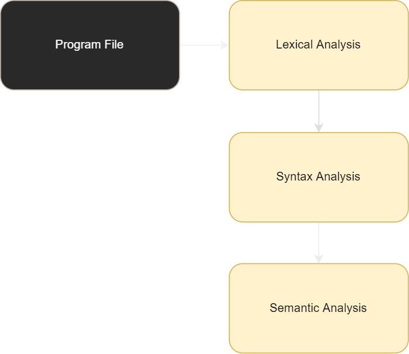

<div id="top"></div>


<!-- PROJECT LOGO -->
<br />
<div align="center">
  

  <h1 align="center">PAL Compiler</h1>

  <h3 align="center">
    Compiler for the Pretty Awful Language
  </h3>
</div>


<!-- TABLE OF CONTENTS -->
<details>
  <summary>Table of Contents</summary>
  <ol>
    <li>
      <a href="#about-the-project">About The Project</a>
      <ul>
        <li><a href="#built-with">Built With</a></li>
      </ul>
    </li>
    <li><a href="#license">License</a></li>
    <li><a href="#acknowledgments">Acknowledgments</a></li>
  </ol>
</details>


<!-- ABOUT THE PROJECT -->
## About The Project


The compiler was built with C++ using the CompilerKit for recursive descent parsing. The project takes in a text file and goes through three stages to ensure its conforming with PAL




### Built With

* [C++](https://cplusplus.com/)


<!-- LICENSE -->
## License

Distributed under the MIT License.


<!-- ACKNOWLEDGMENTS -->
## Acknowledgments

*  [CompilerKit](https://amyparent.com/CompilerKit/)


## PAL EBNF

```
<Program> ::= PROGRAM Identifier
              WITH <VarDecls> 
              IN (<Statement>)+
              END ;
              
<VarDecls> ::= (<IdentList> AS <Type>)* ;

<Type> ::= REAL | INTEGER ;

<Statement> ::= <Assignment> | <Loop> | <Conditional> | <I-o> ;

<Assignment> ::= Identifier = <Expression> ;

<Loop> ::= UNTIL <BooleanExpr> REPEAT (<Statement>)* ENDLOOP ;

<Conditional> ::= IF <BooleanExpr> THEN (<Statement>)*
                      ( ELSE (<Statement>)* )? 
                      ENDIF ;

<I-o> ::= INPUT <IdentList> | 
          OUTPUT <Expression> ( , <Expression>)* ;

<Expression> ::= <Term> ( (+|-) <Term>)* ;

<Term> ::= <Factor> ( (*|/) <Factor>)* ;

<Factor> ::= (+|-)? ( <Value> | "(" <Expression> ")" ) ;

<Value> ::= Identifier | IntegerValue | RealValue ;

<BooleanExpr> ::= <Expression> ("<" | "=" | ">") <Expression> ;

<IdentList> ::= Identifier ( , Identifier)* ;

microsyntax 

Identifier   <|[a-zA-Z]\w*
RealValue    <|\d+\.\d*
IntegerValue <|\d+
```

<p align="right">(<a href="#top">back to top</a>)</p>
